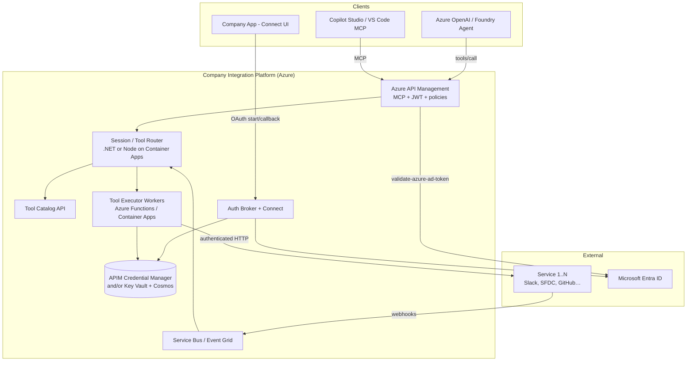
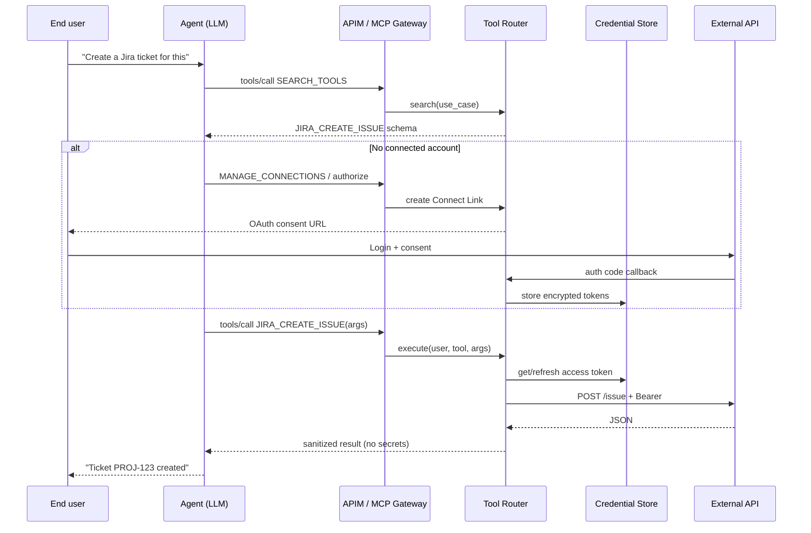
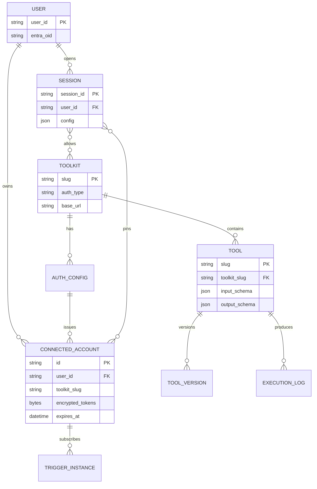
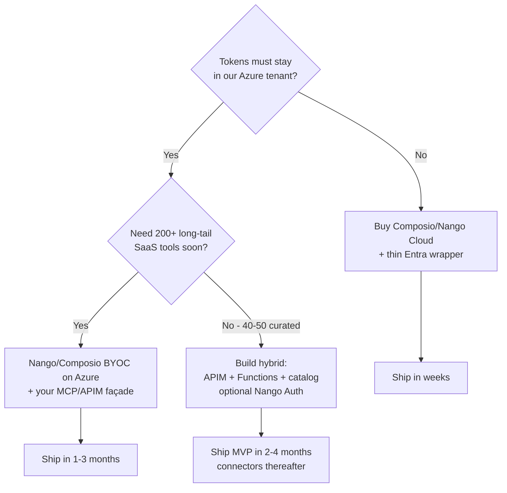

# Rebuilding a Composio-like Agent Integration Platform on Microsoft Stack

Research brief for an in-house platform that connects AI agents to **40–50 external services**, with per-user OAuth, tool discovery, credential-safe execution, and MCP support — designed for a Microsoft-centric company.

**Audience:** engineering leadership, architects, platform teams  
**Scope:** how tools like [Composio](https://composio.dev) work under the hood, what to build vs reuse, Microsoft Azure/Entra mapping, GitHub reference repos, implementation plan, and build-cost ranges.

---

## 1. Executive summary

Composio (and peers like Nango, Pipedream Connect, Arcade) are **not** “just API wrappers.” They are an **auth + execution broker** for agents:

1. The LLM never sees OAuth tokens.
2. Tools are described as **JSON Schema actions** grouped into **toolkits** (apps).
3. A **session / tool router** lets the agent *search → connect → execute* without loading thousands of tool definitions into context.
4. Optional **MCP** endpoints expose the same surface to Claude, Cursor, Copilot Studio, etc.

For a Microsoft shop with ~40–50 services, the pragmatic path is usually:

| Approach | When it fits | Rough all-in build cost |
| --- | --- | --- |
| **A. Buy + wrap** (Composio / Nango Enterprise on Azure BYOC) | Fastest to value; you own UX and Entra SSO | $80k–$200k integration + vendor fees |
| **B. Hybrid Microsoft native** (APIM Credential Manager + MCP + Azure Functions tool executors) | Strong Entra/compliance needs; limited third-party catalog | $250k–$550k for platform + first 40–50 connectors |
| **C. Full in-house Composio clone** | Hard data-residency / IP / multi-tenant product requirements | $600k–$1.5M+ year-1, then heavy maintenance |

**Recommendation for most Microsoft companies:** start with **B (hybrid)**, optionally stand on **Nango open-source auth/proxy** (or APIM Credential Manager) rather than reinventing OAuth for 50 providers. Build the **agent session / meta-tools / MCP gateway** yourselves on Azure.

---

## 2. How Composio-like platforms work in the background

### 2.1 Core concepts (Composio v3 terminology)

| Concept | Meaning | Example |
| --- | --- | --- |
| **User ID** | Stable ID from *your* app; connections are isolated under it | `user.id` UUID |
| **Toolkit** | One external product / API surface | `github`, `gmail`, `slack` |
| **Tool** | One LLM-callable action with input/output JSON Schema | `GITHUB_CREATE_ISSUE` |
| **Auth config** | App-level OAuth client (client id/secret, scopes, redirect) | Your GitHub OAuth App |
| **Connected account** | One user’s granted tokens for a toolkit (multi-account OK) | Work Gmail + personal Gmail |
| **Session** | Runtime context: user + allowed toolkits + auth + execution state | `composio.create(userId)` |
| **Meta tools** | Small fixed set for discovery/auth/execute (keeps context small) | `COMPOSIO_SEARCH_TOOLS`, `COMPOSIO_MANAGE_CONNECTIONS`, execute |
| **Provider / MCP** | Adapter to OpenAI/Anthropic/LangChain **or** MCP URL | `@composio/openai`, `session.mcp.url` |
| **Trigger** | Inbound event subscription (webhooks) | New Slack message → your agent |

Sources: [How Composio works](https://docs.composio.dev/docs/how-composio-works), [Sessions vs direct execution](https://docs.composio.dev/docs/sessions-vs-direct-execution), [Secure AI agent infrastructure guide](https://composio.dev/content/secure-ai-agent-infrastructure-guide).

### 2.2 The critical security pattern: brokered credentials

```
┌─────────┐   tool call (slug + args)   ┌──────────────────┐   API + Bearer   ┌────────────┐
│  LLM /  │ ──────────────────────────► │  Execution broker │ ───────────────► │ Salesforce │
│  Agent  │ ◄────────────────────────── │  (never returns   │ ◄─────────────── │ / GitHub / │
└─────────┘   sanitized JSON result     │   tokens to LLM)  │                  │ Slack …    │
                                        └────────┬─────────┘                  └────────────┘
                                                 │
                                        ┌────────▼─────────┐
                                        │ Encrypted token  │
                                        │ store + refresh  │
                                        └──────────────────┘
```

If tokens enter the model context, prompt injection can exfiltrate them (OWASP LLM risk). Composio’s model is: **LLM decides *what*; broker does *how*.**

### 2.3 Runtime flow (session / tool router)

Typical agent loop:

1. App creates a **session** for `user_id` (optionally restrict toolkits).
2. Agent receives **meta tools only** (search / manage connections / multi-execute), not 50k tool schemas.
3. Agent calls **search** with a use-case → broker returns relevant tool slugs + schemas (+ optional “skills”).
4. If no connected account → **authorize** / Connect Link → user completes OAuth → tokens stored under user.
5. Agent **executes** tool → broker loads connection, refreshes token, calls upstream API, truncates/normalizes response (often via a **sandbox** for large payloads).
6. Multi-turn: reuse `session_id` so auth, tool memory, and workbench files persist.

### 2.4 Direct execution vs sessions

| Mode | Who picks tools | Auth | Best for |
| --- | --- | --- | --- |
| **Session + meta tools** | Agent at runtime | In-chat connect | Autonomous agents |
| **Direct tools** | Your code up front | You manage links | Deterministic workflows |
| **MCP** | Client lists/calls tools | Session-scoped URL/headers | Cursor, Claude, Copilot |

### 2.5 What the platform must implement (subsystem list)

1. **Provider catalog** — OAuth metadata per API (auth URL, token URL, refresh, scopes, base URL).
2. **Auth / Connect UI** — white-label consent, PKCE, callback, BYO OAuth apps.
3. **Connection store** — encrypted access/refresh tokens, multi-account, revoke.
4. **Token refresher** — proactive + on-401 refresh; clock skew; rotating refresh tokens.
5. **Tool catalog** — versioned JSON Schema tools; tags; deprecation; scopes required per tool.
6. **Execution proxy** — inject credentials, retries, rate limits, idempotency, audit logs.
7. **Tool router / session service** — meta tools, search index, connected-account binding.
8. **MCP gateway** — per-user or per-session MCP endpoint, auth to *your* IdP.
9. **Triggers** — webhook registration, signature verify, fan-out to queues.
10. **Observability** — per-tenant fairness, OpenTelemetry, PII redaction in logs.
11. **Admin / developer portal** — enable toolkits, scopes, version pins, kill switches.
12. *(Optional)* **Sync engine** — for RAG/data freshness (Nango’s strength; Composio focuses on actions).

---

## 3. Mermaid overview — target Microsoft architecture

### 3.1 System context



### 3.2 Sequence — agent tool call with OAuth



### 3.3 Logical data model



---

## 4. Tools / Azure services you need

### 4.1 Platform building blocks (Microsoft stack)

| Capability | Recommended Azure / Microsoft component | Notes |
| --- | --- | --- |
| Edge / MCP / policies | **Azure API Management** | Expose MCP servers; `validate-azure-ad-token`; outbound `get-authorization-context` via **Credential Manager** |
| Company identity | **Microsoft Entra ID** | SSO for admins + agent clients; app registrations per external OAuth *app* you own |
| Secrets | **Azure Key Vault** | Client secrets, encryption keys; Prefer APIM Credential Manager for *user* OAuth tokens where supported |
| User token store (if not APIM) | **Cosmos DB** or **Azure SQL** + envelope encryption | Store refresh tokens encrypted; never log plaintext |
| Session + catalog APIs | **Azure Container Apps** or **App Service** (.NET 8 / Node) | Tool router, search, connect links |
| Tool executors | **Azure Functions** (Durable for long jobs) | One Function App per toolkit *or* generic OpenAPI executor |
| Async / webhooks | **Service Bus** + **Event Grid** | Triggers, retries, poison queues |
| Search over tools | **Azure AI Search** or in-DB full-text | Power `SEARCH_TOOLS` meta-tool |
| Observability | **Azure Monitor** + OpenTelemetry | Per-connection latency, 401/429 rates |
| Agent runtime | **Azure AI Foundry / Azure OpenAI** | Agents that call your MCP or function tools |
| Optional workflows | **Logic Apps Standard** | Human/ops automations; not a substitute for the agent broker |
| Optional K8s MCP plane | **[microsoft/mcp-gateway](https://github.com/microsoft/mcp-gateway)** | Session-aware MCP reverse proxy on AKS |
| Admin UI | **React / Blazor** on App Service / Static Web Apps | Enable toolkits, view connections, audit |

### 4.2 Software you should *not* reinvent first

| Problem | Prefer | Avoid building year-1 |
| --- | --- | --- |
| OAuth for 900+ providers | **Nango** self-host/BYOC, or APIM Credential Manager + curated providers | Hand-rolling 50 OAuth quirks |
| MCP reverse proxy | microsoft/mcp-gateway or APIM MCP | Custom sticky-session proxy |
| LLM ↔ tool schema adapters | OpenAI/Anthropic/MCP standards | Per-framework one-offs without a provider layer |

### 4.3 Connector implementation toolkit (per service)

For each of the 40–50 services, you typically need:

1. **OAuth app** (or API key / JWT / basic) registered at the vendor.
2. **Auth config** in your broker (client id/secret in Key Vault, scopes, redirect URI = your Connect callback).
3. **Tool definitions** — either:
   - Hand-authored JSON Schema tools (LLM-optimized names/descriptions), or
   - Generated from **OpenAPI** then curated (descriptions matter a lot for agents).
4. **Executor** — thin HTTP client calling the vendor API through the proxy.
5. **Tests** — auth refresh, rate-limit, schema golden files, sandbox account.
6. **Optional triggers** — webhook receiver + verification secret.

---

## 5. How existing GitHub projects deal with this

### 5.1 Primary references

| Repo | License / model | What to learn / reuse |
| --- | --- | --- |
| [ComposioHQ/composio](https://github.com/ComposioHQ/composio) | SDK-focused monorepo | Session API, provider adapters, tool type schemas (`ToolSchema` with JSON Schema I/O, versions, scopes). **Server/catalog is mostly hosted** — SDK is the public surface. |
| [NangoHQ/nango](https://github.com/NangoHQ/nango) | Open source (Elastic License; free self-host limited) | **Best OSS blueprint**: Auth → Connection → Proxy → Actions/Syncs → MCP. Self-hostable. Write TypeScript functions per integration. |
| [NangoHQ/github-api-integration](https://github.com/NangoHQ/github-api-integration) | Example app | End-to-end pattern: Connect UI + sync + actions + agent over hosted MCP. |
| [microsoft/mcp-gateway](https://github.com/microsoft/mcp-gateway) | Microsoft OSS | K8s MCP gateway: adapters, tools registry, Entra auth hooks, optional Foundry agents/sessions. |
| [Azure-Samples/AI-Gateway](https://github.com/Azure-Samples/AI-Gateway) | Samples | Labs for **APIM + MCP + Credential Manager** (GitHub Issues, ServiceNow). Closest “Microsoft native Composio slice.” |
| [MicrosoftDocs APIM secure MCP](https://learn.microsoft.com/en-us/azure/api-management/secure-mcp-servers) | Docs | Production pattern: Entra JWT in, Credential Manager token out. |
| [mdspinali/mcp-entra-proxy](https://github.com/mdspinali/mcp-entra-proxy) | Community | Bridges MCP RFC 8707 `resource` param vs Entra v2 rejecting it — relevant if MCP clients talk to Entra-protected servers. |
| [atrawog/mcp-oauth-gateway](https://github.com/atrawog/mcp-oauth-gateway) | Community | OAuth 2.1 + PKCE + dynamic client registration in front of unmodified MCP servers. |
| Logic Apps connector extensibility | [MS Learn](https://learn.microsoft.com/en-us/azure/logic-apps/custom-connector-overview) | Useful for **workflow** connectors; weaker fit as the *agent tool router* (prefer Functions + MCP). |

### 5.2 How Nango structures the problem (recommended mental model)

Nango’s three primitives map cleanly to a Composio rebuild:

1. **Auth** — Provider → Integration (your OAuth app) → Connection (per-user credentials).
2. **Proxy** — `connectionId` + path → inject token → upstream.
3. **Functions** — Actions (tool calls) and Syncs (data replication); can be exposed as **MCP tools**.

Composio adds agent-native layers on top: **sessions, meta-tool search, response shaping, sandbox**. If you self-host Nango on Azure for Auth+Proxy+Actions, you still build Session/Search/MCP productization — or use Nango’s MCP + your Entra-facing gateway.

### 5.3 How Composio structures tools (schema ideas to copy)

From their public SDK types:

- Toolkit: `slug`, `name`, `logo`, auth metadata.
- Tool: `slug` (`TOOLKIT_ACTION`), `description`, `inputParameters` / `outputParameters` (JSON Schema), `tags`, `version`, `scopes`, `isNoAuth`.
- Version pins: dated `YYYYMMDD_NN` for deterministic code; `latest` for agents.

**Design rule:** spend time on tool *descriptions* and parameter names — agent quality depends more on this than on clever routing.

### 5.4 Peer landscape (for build-vs-buy)

| Product | Strength | Weakness for Microsoft rebuild |
| --- | --- | --- |
| **Composio** | Agent sessions, 1000+ toolkits, meta-tools | Hosted-first; less “own the sync layer” |
| **Nango** | OSS, auth+proxy+sync+actions, self-host/BYOC | You write/maintain action functions |
| **Pipedream Connect** | Huge catalog, connect proxy | Less “session meta-tool” agent UX |
| **Merge / unified APIs** | Normalized CRM/HR models | Wrong abstraction for arbitrary agent actions |
| **APIM + Foundry** | Native Entra, compliance story | You still author tools/connectors |

---

## 6. Implementation plan (40–50 services)

### Phase 0 — Decisions (1–2 weeks)

- Confirm **must-have services** (tier A: 10; tier B: 20; tier C: 15–20).
- Data residency / “tokens never leave our tenant” → forces BYOC or full build.
- Agent surfaces: Foundry only vs also Copilot Studio / Cursor MCP.
- Buy boundary: e.g. **Nango for Auth+Proxy** vs **APIM Credential Manager only** (APIM covers fewer SaaS OAuth providers out of the box; often enough for Microsoft + a curated set).

### Phase 1 — Platform spine (6–10 weeks)

1. Entra app registrations + APIM instance (dev/prod).
2. Connection data model + encryption (Key Vault keys).
3. Connect UI (start OAuth, callback, list/revoke connections).
4. Generic **authenticated HTTP proxy** (connection-scoped).
5. Tool catalog service (CRUD + versioning + search index).
6. Session API: `create` / `use` / `execute` + meta tools.
7. MCP façade on APIM (or mcp-gateway on AKS).
8. Audit log + basic admin portal.

**Exit criteria:** one pilot toolkit (e.g. GitHub or Microsoft Graph) works end-to-end: connect → search → execute → MCP from a test client.

### Phase 2 — Connector factory (parallelizable, 8–16 weeks)

Establish a **connector template**:

```
connectors/
  github/
    auth.json          # endpoints, scopes, token placement
    tools/*.tool.json  # JSON Schema tools
    executor/          # Function or shared OpenAPI runner
    triggers/          # optional
    tests/
```

Throughput guideline for a trained team:

| Connector class | Examples | Effort each |
| --- | --- | --- |
| Simple REST + clean OAuth | GitHub, Slack, Notion | 3–8 engineer-days |
| Complex enterprise | Salesforce, SAP, ServiceNow | 2–4 engineer-weeks |
| Microsoft Graph family | Mail, Calendar, SharePoint, Teams | 1–2 weeks once Graph auth is solid (shared) |
| API-key only | Some IT tools | 1–3 days |

For **45 connectors**, a realistic mix (~25 simple, ~15 medium, ~5 hard):

- ~25×5d + 15×10d + 5×15d ≈ **400 engineer-days** ≈ **2 FTE for ~4–5 months**, plus review/security.

Use codegen from OpenAPI where possible, then **human-edit descriptions** for LLM use.

### Phase 3 — Production hardening (4–8 weeks)

- Rate-limit fairness per tenant/connection.
- Token refresh job + alerting on refresh failures.
- Scope least-privilege matrix per tool.
- Red-team prompt-injection tests (ensure no secret leakage in tool results).
- SLOs, runbooks, chaos on vendor 429/5xx.
- Toolkit versioning policy (pin in prod pipelines; latest in agents).

### Phase 4 — Scale & productize

- Customer-facing “Integrations” settings in your product.
- Trigger → Service Bus → agent wake-up.
- Optional sync/RAG pipelines for selected systems.
- Cost dashboards (executions per toolkit).

---

## 7. Cost estimates (to *build*)

Figures are **order-of-magnitude** in USD for a Western/EU blended team (~$150–200/hr fully loaded for senior platform engineers; adjust to your rates). Vendor marketing numbers often cite $8k–$25k **per integration** and ~$3k–$6k/year maintenance ([build-vs-buy analyses](https://inqodo.com/blogs/build-vs-buy-saas-integrations-cost); [Composio build-vs-buy](https://composio.dev/content/build-vs-buy-ai-agent-integrations)).

### 7.1 One-time build

| Workstream | Low | Mid | High | Notes |
| --- | --- | --- | --- | --- |
| Platform spine (auth, proxy, sessions, MCP, admin) | $120k | $220k | $400k | 2–4 seniors, 2–4 months |
| 40–50 connectors (mixed complexity) | $200k | $350k | $600k | Dominated by enterprise APIs + QA |
| Security / compliance (threat model, pen test, SOC mapping) | $40k | $80k | $150k | Higher if multi-tenant SaaS |
| Foundry/agent UX integration | $30k | $60k | $120k | Product surface |
| **Total build** | **~$390k** | **~$710k** | **~$1.27M** | Full clone territory at the high end |

**Hybrid (recommended):** reuse Nango or APIM Credential Manager for auth → often **cuts $80k–$200k** and months of OAuth edge cases off the spine.

### 7.2 Annual run cost (after launch)

| Item | Mid estimate |
| --- | --- |
| Connector maintenance (API churn) | $150k–$300k/yr (≈ 1–2 FTE) for 45 connectors |
| Platform on-call / features | $150k–$250k/yr |
| Azure (APIM Premium/Standard, Container Apps, Functions, Cosmos, Monitor) | $3k–$20k/mo depending on tier & traffic |
| Optional vendor (Nango/Composio Enterprise) | Custom; often cheaper than 2 FTEs if catalog coverage fits |

Composio’s public SKUs (indicative): Free capped tool calls; Pro ~$29/mo + usage; Enterprise custom (VPC/SSO). Nango: Free → Pay-as-you-go (~$50 credits) → Enterprise BYOC. Use these as **buy** baselines against your **build** mid case (~$700k + ~$300k/yr).

### 7.3 Decision shortcut



---

## 8. Suggested Microsoft reference architecture (concrete)

**Minimal viable “internal Composio”:**

1. **APIM**  
   - Inbound: Entra JWT / MCP OAuth.  
   - Outbound: Credential Manager where provider supported; else call your Auth Broker.
2. **Auth Broker** (Container App)  
   - OAuth start/callback; stores connections in Cosmos; secrets in Key Vault.
3. **Tool Router**  
   - Meta tools + `execute`; queries Azure AI Search over tool descriptions.
4. **Executors**  
   - Azure Functions keyed by `toolkit_slug`; shared HttpClient with retry/429 backoff.
5. **MCP**  
   - APIM MCP server **or** microsoft/mcp-gateway on AKS exposing Tool Router.
6. **Agents**  
   - Azure AI Foundry agent with MCP tool connection to your gateway.

Pilot order that de-risks the platform:

1. Microsoft Graph (Mail or Calendar) — Entra-native.  
2. GitHub — well-documented OAuth + rich tools (see Azure-Samples AI-Gateway lab).  
3. Slack or Teams — messaging patterns.  
4. One “painful” enterprise system (Salesforce/ServiceNow) — proves the factory.

---

## 9. Risks and design pitfalls

| Risk | Mitigation |
| --- | --- |
| Context window explosion (too many tools) | Meta-tool search; hard toolkit allowlists per session |
| Over-broad OAuth scopes | Per-tool required scopes; progressive consent |
| Refresh-token rotations / sudden revoke | Alerting; Connect UX to re-auth; degrade gracefully |
| Prompt injection → data exfil via tools | Allowlist tools; human approval for destructive actions; egress policies |
| Treating Logic Apps as the agent platform | Use Logic Apps for ops; keep brokered tool execution in APIM/Functions |
| Generating tools blindly from OpenAPI | Always curate names/descriptions; hide dangerous ops |
| Building syncs too early | Ship actions first; add sync/RAG only for clear product needs |

---

## 10. Sources

### Product / docs
- [Composio — How it works (sessions)](https://docs.composio.dev/docs/how-composio-works)
- [Composio — Sessions vs direct execution](https://docs.composio.dev/docs/sessions-vs-direct-execution)
- [Composio — Secure AI agent infrastructure](https://composio.dev/content/secure-ai-agent-infrastructure-guide)
- [Composio — Per-user OAuth for agents](https://composio.dev/content/per-user-oauth-for-ai-agents)
- [Nango — Auth / Proxy / Unified APIs](https://nango.dev/docs/guides/functions/unified-apis)
- [Azure APIM — Credential Manager](https://learn.microsoft.com/en-us/azure/api-management/credentials-overview)
- [Azure APIM — Secure MCP servers](https://learn.microsoft.com/en-us/azure/api-management/secure-mcp-servers)

### GitHub
- https://github.com/ComposioHQ/composio  
- https://github.com/NangoHQ/nango  
- https://github.com/NangoHQ/github-api-integration  
- https://github.com/microsoft/mcp-gateway  
- https://github.com/Azure-Samples/AI-Gateway  
- https://github.com/mdspinali/mcp-entra-proxy  

### Cost / build-vs-buy
- https://composio.dev/content/build-vs-buy-ai-agent-integrations  
- https://inqodo.com/blogs/build-vs-buy-saas-integrations-cost  
- https://nango.dev/pricing/  
- https://composio.dev/content/composio-vs-nango  

---

## 11. Bottom line

Composio-class systems are an **agent-facing control plane**: per-user OAuth, encrypted connections, JSON Schema tools, a session-scoped tool router, credential-safe execution, and MCP.  

On Microsoft stack, **do not start by cloning 1,000 toolkits**. Build (or buy) the **spine** on **Entra + APIM + Functions/Container Apps**, reuse **Nango or APIM Credential Manager** for OAuth/proxy where possible, and industrialize a **connector factory** for your fixed set of **40–50** services.  

Budget planning: expect on the order of **$0.4M–$0.8M** to reach a credible internal platform with that connector count (hybrid), or **materially less** if you BYOC a vendor and only build the Entra/MCP façade — versus **$1M+** and ongoing multi-FTE maintenance for a full greenfield clone.
