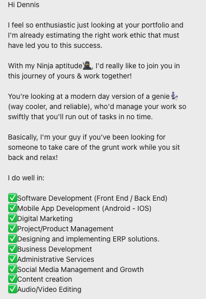
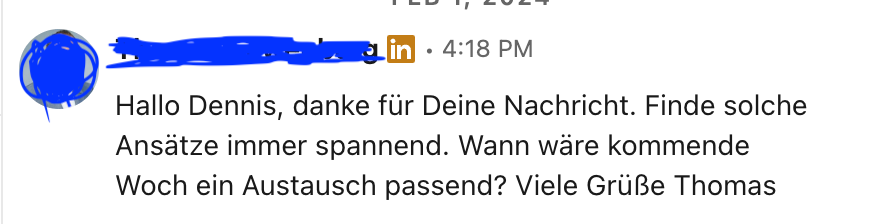
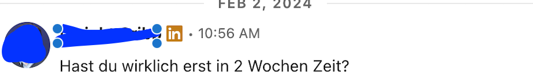
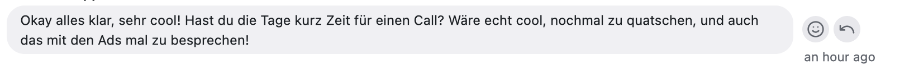
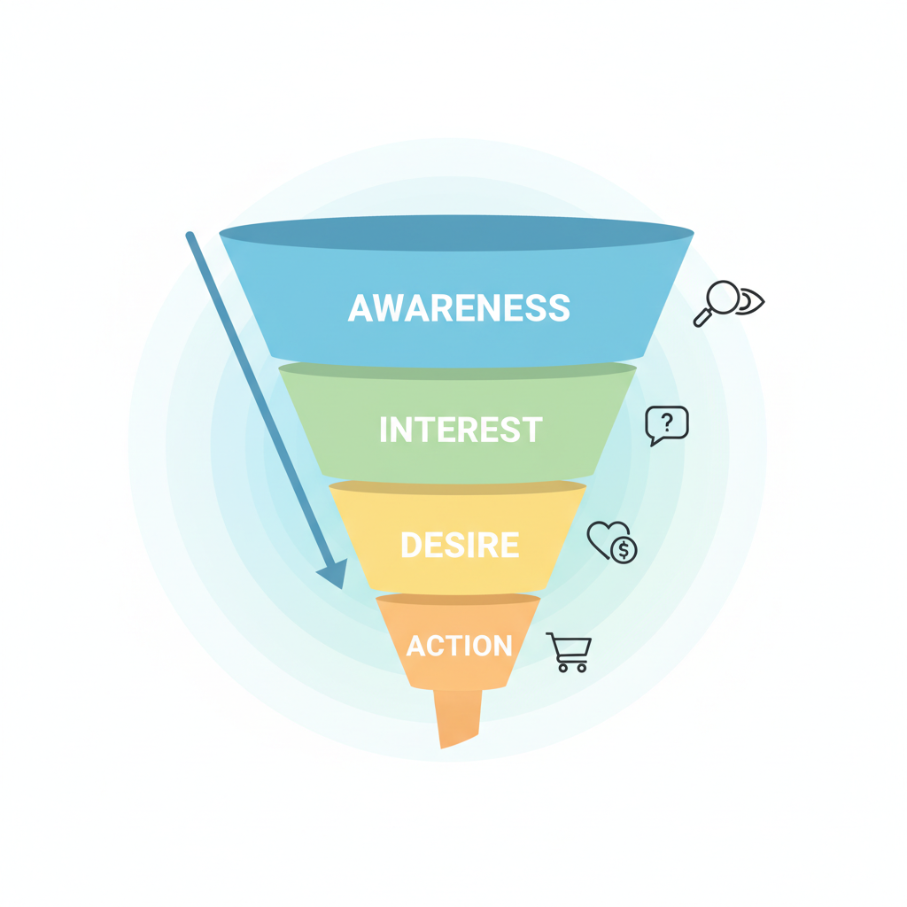
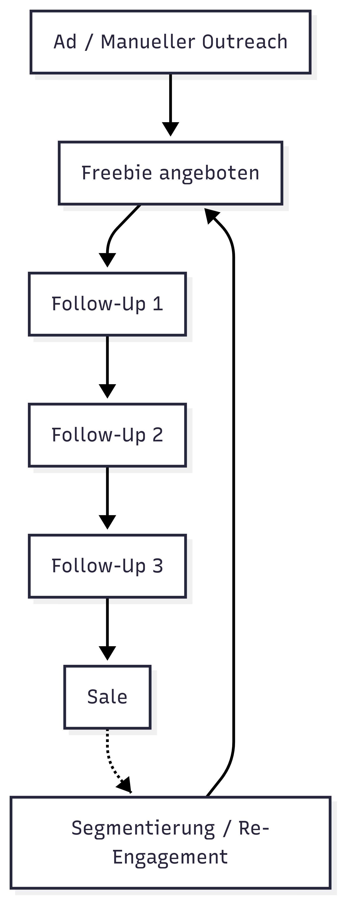
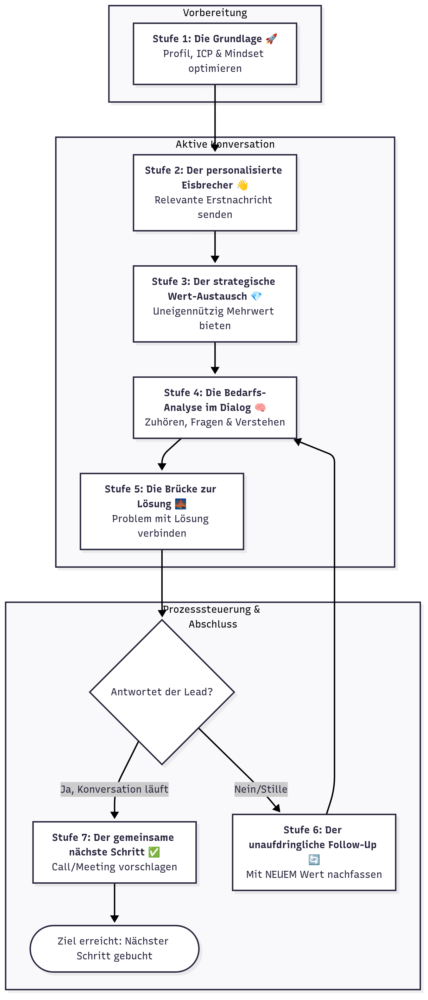

# Before You Start

## License

Learn more about the licensing model of **Chat-Closing**. Have a question? Write to us, we'll help you.

### Introduction

"The Chat Sales" is a trade name of **Histack, Inc.** Throughout the license agreement, "The Chat Sales" refers to **Histack, Inc.**

### Digital Product

**Digital Product:**

The digital good you receive after purchase or via opt-in from **Chat-Closing** may include, for example:

- Courses
- Templates
- Modules
- Resources
- Recorded videos
- Figma kits
- Website templates
- Google Docs
- Notion documents
- Other digital materials

This license applies to the digital product you purchased, received via opt-in, or otherwise acquired, including all content and components.

### Personal License

**Chat-Closing** grants you a perpetual, non-exclusive license to use the digital product.

The license allows **you alone** to access and use the digital product.

### You May:

- Use the digital product to improve your own knowledge and skills.
- Adapt the digital product for personal use (these adaptations fall under this license).
- Use the knowledge and resources from the digital product to create any number of end products for yourself.
- Apply strategies and techniques from the digital product in your own work.
- Use templates or resources from the digital product to develop materials for your own business.

### You May Not:

- Share, transfer, or sell the digital product or derivative works.
- Give others access to the digital product.
- Use the digital product to create courses, workshops, or training materials that compete with Histack, Inc.
- Make parts of the digital product publicly available, e.g., on:
  - Online platforms
  - Social media
  - File-sharing services
- Use the digital product to create content that, in Histack, Inc.'s sole discretion, is considered competitive or conflicting.

### Usage Examples

**Allowed:**

- Study the course materials to improve your LinkedIn lead generation.
- Use templates and resources from the digital product to create marketing materials for your business.
- Apply learned techniques from the digital product to build content and audience.
- Implement CRM setups and automations in your business based on what you've learned.

**Not Allowed:**

- Share course videos, templates, or materials with friends, colleagues, or the public.
- Upload parts of the digital product to websites, forums, or social media.
- Incorporate parts of the digital product into your own courses or training.
- Sell or transfer the digital product or derivative works to third parties.
- Create a competitive product, course, or template based on the digital product.

**In Short:** Use the digital product you purchased or received via opt-in from Histack, Inc. to improve your skills and business. But don't share, sell, or compete with it.

### Definitions

- **Licensee:** You, who purchased, received via opt-in, or otherwise acquired the personal license.
- **Digital Product:** The digital good you received from Histack, Inc.
- **End Product:** Everything you create that uses elements of the digital product for yourself.

### Enforcement

Copyright in the digital product is owned by **(Histack, Inc.)**. You may only do what is stated in this license; all other rights are reserved. Histack, Inc. may take legal action against unauthorized use outside this license.

### Liability

**Chat-Closing's** liability for costs, damages, or other losses arising from your use of the digital product – including third-party claims – is limited to a refund of the license fee. Histack, Inc. is not liable for consequential damages.

This agreement is governed by the laws of New South Wales, Australia. Disputes may only be brought before the courts of New South Wales. You agree to service of notices at the email address provided with your order.

### Questions?

Not sure which license you need or whether your use case is covered? Write to us!

Feel free to write: [fragen@histack.io](mailto:fragen@histack.io)

## Disclaimer

The strategies and tactics described in this book are based on practices and insights at the time of creation. LinkedIn and sales strategies are constantly evolving, and what works today may not work tomorrow.

Please note: These teachings, tools, and methods are provided solely for informational purposes. It is your responsibility to ensure compliance with LinkedIn's terms of use, any third-party terms, and applicable local laws and regulations. By using this content, you assume full responsibility for your actions and their consequences.

## A Simpler & Faster Way

One more thing before we begin…

The system you're about to learn works.

No matter what you learn.

No matter what we teach you.

> [!WARNING] > **There is no "Overnight Success."** > **Anyone who tells you otherwise wants to sell you something.**

This system has already been used by over 100 founders, experts, salespeople, and entrepreneurs. However, the system requires one thing above all: practice.
************
To succeed, it's important that you follow **every** step of the system.

> [!WARNING] > **Want faster and easier results?** Work with us. Book [an appointment for a conversation here](Der%20Chat-Verkauf%20-%20Hochpreis-Kunden%20gewinnen%20mit%20D%2027c1f97cb6ae808ea969e09d4115aa8a.md). Let's discover what's possible for your business.

# Foreword

Life is sales.

We sell every day and constantly:

To friends, family, colleagues, strangers… even to our children.

We don't always sell the same thing: Sometimes it's goods, services, ideas, beliefs, and values… or completely different things.

We give something to get something.

For this transfer to happen, trust is needed.

The trust that the other person keeps their word and that what I receive has the value promised to me. Whether this happens over the phone, through online advertising, an email, or chat is completely irrelevant.

"Pitchslaps" are messages in which the other person starts the conversation directly with an offer.

Here's an example:

I'm directly "spammed" – with terribly bad compliments.

This is a spaghetti method: Just throw it at the wall and see what sticks. This is not a sales strategy; it's the principle of "hope" – and simply no longer tenable today.

### The New Way

You know what works? Giving and helping.

When you give your potential customer real value, trust builds.

It's the simplest and most scalable way to start real conversations, build trust, and close deals.

**People hate it when you try to sell to them.**

**People love it when they can talk about themselves and their problems.**

No fancy funnels. No "hacks." Just you, your LinkedIn account, and the magic of being truly helpful.

**Is it easy?** Absolutely not. It requires work. But exactly this kind of work pays off because it's based on serving rather than selling. When you do it right, selling no longer feels uncomfortable – it feels... natural.

This is not another "hack." It's the smart way to turn effort into results. All you need is willingness to act, a bit of commitment, and this playbook in your hands.

Ready?

**Let's turn your DMs on LinkedIn into cash.**

> [!WARNING]
> I hate "hacks." Hacks are for those who don't want to do the work. For those who, even after 10 years, wonder why they're not making progress. The only thing that really helps is a system that you then follow step by step.

## Why LinkedIn?

There are dozens of social media platforms. Why LinkedIn specifically?

On LinkedIn, people are there to do business. They expect conversations to develop into business. That doesn't mean these strategies don't work on TikTok or Instagram – people there are in "leisure mode." That makes things a bit harder.

On LinkedIn, you can use tools like Sales Navigator to find your desired customers precisely – listed by title, position, and company. No other platform can do that.

People are waiting to be contacted.

**Not a pitch, but a conversation.**

That's what this is about: Mastering chat closing, sales via direct message.

> [!WARNING]
>
> ### Why Not Automate?
>
> Yeah, the dear automation – and lately AI too.
> These two things are promised to us as the ultimate solution. The problem is: **Sh!t in, Sh!t out.**
> Most people try to get around doing their homework and instead start making money directly.
> This brute-force method leads to bad direct messages, which leads to loss of reputation, which leads to few sales and ultimately poor results. In the end, people become disillusioned…
> **Automation and AI won't save you.**
> In a later chapter, we'll deal with the topic of offers and ideal customer profile (ICP).

## How You Should Use This Book

1. Read it from start to finish.
2. These are no "hacks," this is a system – work with it.
3. Learn the basics.
4. Be prepared that you'll have a learning curve.
5. Don't think about scaling.
6. Don't delegate it to others. I know, if you're a CEO, you hate such tasks. But you should do the work yourself for the first week. Then delegate.

### The Scaling Trap

> "But, Dennis, chats can't be scaled!"

Yes, they can. But when you start with the system, that's not the point.

It's about dealing with the basics.

> "Do things that don't scale" – Paul Graham (ironically, the LinkedIn founder)

So, just start.

# Prerequisites

All you need is the will to start. It doesn't matter how your LinkedIn profile looks, whether your banner is perfect, or whether your offer is already finished. If you go for "perfection," then nothing is ever right or good. "Just start" is the path to success. Because on the way to your goal, you'll adapt, learn, and adapt even more.

Why? Because you'll FINALLY be talking to people. We'll describe this in detail in the "Pre-Selling" chapter. Most entrepreneurs, experts, and solopreneurs talk far too little with their potential customers. New ideas are developed and thought up in ivory towers.

Your most important skill is listening. Because surprisingly, people share with you what concerns them and what they need – and these are exactly the building blocks you need to create a perfect offer.

**Every conversation with a person is a goldmine.**

Completely regardless of whether a deal happened in the end.

So the prerequisites to get started are: A LinkedIn account.

For many, this feels wrong. I can understand that; I felt the same way before. If instead you want to:

1. Find, create, or improve your offer.
2. Your LinkedIn profile needs optimization.
3. Or you want to prepare yourself overall to start faster…

Let's talk. Book [an appointment here](Das%20System%20f%C3%BCr%20planbare%20Premium-Kunden%2027b1f97cb6ae80c29938c27c3775bdbe/Wenn%20du%20nichts%20anderes%20liest,%20dann%20lies%20das%20hier%2027c1f97cb6ae803599c2e5eb51284046.md):

> [!NOTE] 
> > [Click here to book an appointment](Der%20Chat-Verkauf%20-%20Hochpreis-Kunden%20gewinnen%20mit%20D%2027c1f97cb6ae808ea969e09d4115aa8a.md)

**Let's get started.**

─────────────── ✦ ───────────────

# 📖 Chapter 1 - Chat Closing Basics

─────────────── ✦ ───────────────

If you skip Part 1: **Chat Closing Basics**, the rest of this book won't work.

It's not optional.

This section gives you the foundation – the mindset, principles, and understanding you need to be truly successful with **Chat-Closing**.

You can't just copy tactics and hope for the best. If you don't understand the _Why_ behind the approach, your chats will go nowhere, your leads will ignore you, and you'll waste time.

Start here. Take it seriously.

## What Most People Do Wrong on LinkedIn

When you open LinkedIn, you're flooded with empty promises.

**"How I did XYZ with this hack"**

**"These AI tools do my outreach"**

**"Write content like this so everyone clicks on you!"**

These "hacks," as I call them, are drugs. Drugs that make you think you're being productive and taking your business to the next level. In truth, they're distractions from the real problems:

1. Almost no one has good positioning.
2. Almost no one knows their ideal customers.
3. Almost no one has a clear offer.
4. Almost no one works systematically.
5. Almost no one takes enough time. (I'm particularly guilty of this!)

The result is stress. The question lingers whether you might have missed a trend.

In one year, Method A is pushed through the village, and a few months later, it's Method B.

**Yesterday AI, today AI agents, tomorrow…? Who knows.**

Our psychology has probably changed little in the last 100,000 years. As mentioned before, sales is primarily about exchange based on trust. What has changed are the possibilities for building this trust.

In the past, the vacuum cleaner salesman went door to door – ringing doorbells, saying friendly "Hello" and starting a conversation.

Actually, not much has changed. But many believe this behavior can be "hacked." Desperately, they try to find the shortcut.

There isn't one. Don't fall for the posts on LinkedIn.

I don't want to tell you fairy tales: Selling via direct messages works – and it's work.

One more word about content…

## Content is Dead

Organic reach is a time sink for established experts.

I already hear the "gurus" screaming:

- "You just have to post daily!"
- "Just write 2 hours of comments!"
- "More videos, more personality!"

You know it, right?

That's the fastest way to fill your calendar with content tasks – instead of with paying, desired customers.

If you take your business seriously, this "hope marketing" is your biggest enemy.

**Why?**

- 1️⃣ No predictability: Organic is a lottery; you leave your pipeline to chance and the algorithm. That's not how you scale a business.
- 2️⃣ Too high costs: Your time is your most valuable resource. Every hour you spend in the "engagement grind" is an hour you're not making money.
- 3️⃣ Wrong focus: Likes and followers are vanities. What you need are qualified appointments in your calendar. Revenue instead of likes. Period.

How do I know? I wrote over 400 posts on LinkedIn in 2024 (and partly 2025). Reach has dropped dramatically, and LinkedIn is now "Pay-to-win." They just make money from you spending your money with them.

## Why I Believe in LinkedIn

€8,800 in revenue. In 2 weeks.

With 40 messages I would never write again today.

At the beginning of 2024, I wanted to test an idea:

Can executive search firms find candidates faster with an AI solution – and will they pay for it?

1. I had zero experience in the industry.
2. But I wanted to do something with AI.
3. So I did what most avoid:

I put my offer directly to the test.

Brutal direct message.

No relationship. No small talk.

Just copy & paste. 40 times.

### **📊 The Result:**

- → 40 messages
- → 7 appointments
- → 3 contracts
- → €8,800 revenue – in under 14 days.

The idea didn't pan out in the end – that's fine. Against cheap offshore teams, there was no winning. But the decisive lesson was gold:

**You don't need a content marathon to win customers.**

A clear offer + systematic direct outreach = predictable results.

**Even if the execution is imperfect.**

Now imagine what happens when you don't do this with 40 "terrible" messages – but with a professional system that brings you qualified customer inquiries every month.

Well, if the contact gets impatient:

Or from current campaigns:

## Mindset or "Everything is Gone"

I had a pretty bad phone phobia for a long time. It all started when I was about 8 years old. Back then, we were with the family in the USA, and in the middle of the night, someone called the hotel in Miami. My father answered, was calm and composed; it was 4 a.m. our time.

When he hung up, he just said: "Everything is gone. They robbed our store."

My father had a jewelry and antiques store in my hometown. The goods were gone, no insurance. We had nothing left from one second to the next. The phone got a stamp that day: It holds nothing good.

I still have a slight fear of it today. Voice messages on WhatsApp mean to me: Now something bad has happened. The same applies when I'm called from unknown numbers.

**That's why cold calling via phone would be hell for me.**

Luckily, there's LinkedIn. Even here, the fear is latent. But it's much easier to overcome. At the beginning, I was afraid to write to people on LinkedIn. In real life, that was never a problem for me – here it was.

I overcame the fear by simply starting. The 40 messages with €8,800 revenue weren't my first, but throughout 2023 and 2024, I wrote more and more messages.

Today, I don't "care" what anyone thinks. I'll never see these people again, and my polite and respectful manner ensures I can meet anyone again with a clear conscience.

Sure, there are weird people out there, but I've had the experience that most people aren't averse to a conversation.

When you treat each other respectfully – and that requires the right mindset.

## The New Mindset

Probably no word has been abused more than "mindset" – what does it even mean? You could also translate it as "mental models." But since we're not in a philosophy class here, I'll stick with the familiar word "mindset."

Many of us find selling somewhat unsavory: The images in our heads are a door-to-door sales team or an unsympathetic person who wants to "talk us into" something. If you go into sales with this idea, then sales will always feel somewhat shabby – and results will be lacking.

Selling doesn't mean persuading others, but convincing them that you can help them. Sales is more about serving. Serving the customer by solving their problem and finally having peace.

> [!NOTE] > **Mindset Rule 1: Serve, don't sell**

Yes, you want to close the deal – but that's completely irrelevant to the other person. Every person is interested in one thing above all: Themselves. I'll contradict Kant here once, who said (roughly): "Treat everyone as you want to be treated."

Instead, it's: **Treat everyone as they want to be treated.**

So the first step is primarily about seeing yourself as a servant. I mean servant more like a very good waiter who makes you feel like you're REALLY important. Different from the phone recording "Your call is important to us."

> [!NOTE] > **Mindset Rule 2: Give value**

You might know the social media figure Gary Vaynerchuck. He has the motto "Give, give, give" (Jab, Jab, Jab, Hook – his book on it). At its core, it's about giving something first in a new relationship.

In a business context, that means: A tip or a resource. These can be industry insights or a concrete suggestion. The guiding question here is: "What can I do so the other person gets real value from me?"

Two things happen when you help the other person:

1. **You're perceived as an expert.**
2. **You use the power of reciprocity.**

Reciprocity is a psychological mechanism: When someone does us a favor, we have the desire to return that favor. The more you give, the greater the chance that the other person will take time for you – so you both win.

> [!NOTE] > **Mindset Rule 3: Selling is good**

Without sales, our economy doesn't work. Good sales create jobs & make people's lives better. Therefore: Selling is good.

### Common Excuses

While you're reading this text, perhaps one or more of the following thoughts came to mind:

1. **"Feels too salesy"**

   Sure, if you only spam standard pitches to complete strangers, that's salesy – and annoying. But if you genuinely act like a human, listen, and respond to what people really need, it doesn't feel like sales at all. It feels like a conversation between two people who respect each other.

2. **"It takes too long"**

   The truth: Chatting takes time, but it's also the fastest way to results. Done right, it beats cold calls, email sequences, or countless Zoom calls. When you follow this playbook, you know exactly what to say, when, and how to move people forward – without wasting time.

3. **"Leads go cold"**

   Most leads don't really go cold. They're just waiting for you to follow up. The magic lies in follow-ups – the fifth, sixth, or even seventh contact. Don't write anyone off just because they didn't respond immediately. Be persistent but respectful, and you'll bring a lot of "dead" leads back to life.

4. **"Outsourcing doesn't work"**

   You can delegate chat sales – but only if your process is bulletproof. Follow this playbook from start to finish, and you have the structure that makes it work. Leads don't feel like they're talking to a robot; they feel like they're talking to you. And then you sell all day. Every day.

## Important KPIs

Selling always means you're playing a numbers game: Every no, every rejection brings you closer to a sale. That's true everywhere. An example from real life is dating: No one expects to meet the love of their life on the first date. Everyone knows we need to meet countless people for that.

When I sold our AI helper for executive search companies last year, my closing rate was around 7.5%. Neither you nor I should measure ourselves by that, because AI was simply a hype topic at that time.

Let's look at the numbers you can more realistically expect.

The easiest way to check if your chats really work is to measure your **chat-to-contract ratio**.

- **Chats:** How many people do you start conversations with?
- **Contracts:** How many of these conversations become paying customers?

> [!INFO]
>
> ### **Here's What the Calculation Looks Like:**
>
> 1. **Chats Started:** 100 people
> 2. **Response Rate (30%):** 30 responses
> 3. **Engagement Rate (50%):** 15 real conversations
> 4. **Booking Rate (20%):** 3 booked calls
> 5. **Attendance Rate (80%):** 2.4 calls attended
> 6. **Closing Rate (50%):** 1.2 closed sales
>
> ## **Total Conversion Rate: ~1%**

**So: For every 100 people you contact, you should close at least 1 deal – and the better you optimize your process, the more can come from it.**

### **Understanding Important Metrics**

What you should track:

- **Response Rate (30%)** – Of 100 people you contact, how many respond?
- **Engagement Rate (50%)** – Of those who respond, how many have a real, meaningful conversation?
- **Booking Rate (20%)** – Of meaningful conversations, how many book a call?
- **Attendance Rate (80%)** – Of booked calls, how many actually show up?
- **Closing Rate (50%)** – Of calls that are attended, how many end in a sale?

### **Setting Realistic Expectations**

The truth…

If you want to see results, you must make **selling in chat a daily habit**.

The mistakes we often see:

- People dive in completely, send 1000 DMs, feel overwhelmed – and never do it again.
- Others have too much fear to start at all. If that applies to you, the sections **"Prerequisites"** and **"Common Excuses"** will help you get over it.

And remember…

Some people just don't want to chat with you. Some ignore you. Others might reject you directly. And you know what? **That's completely okay.**

You won't close every single person you chat with. **That's not the goal.** The goal is to build relationships, deliver value, and let the right people decide for themselves to work with you.

The better you get and the higher your response rates rise, the better your results will be.

So: **Excuses away, change mindset, and just start talking your way to sales through chatting.**

> [!INFO]
>
> ### **Here's a Guideline:**
>
> - **Contacts per day:** Start with 25–30
> - **Response Rate (30%)** – 7–9 responses
> - **Engagement Rate (50%)** – 3–5 meaningful conversations
> - **Booking Rate (20%)** – 1 call booked
> - **Attendance Rate (80%)** – 0.8 calls attended
> - **Closing Rate (50%)** – 0.4 sales/day
>   At this pace, you make **1–2 sales per week** if you only work 5 days.

─────────────── ✦ ───────────────

# 📖 Chapter 2 - The Rules

─────────────── ✦ ───────────────

Selling through chatting is a skill. Like any other skill, it can be learned and improved. Your first messages will still feel awkward, probably clumsy too – but over time, your skills will improve.

> [!TIP]
> To make your life easier, here's a list of rules you should follow:
>
> ### Rule 1: Don't Behave Like an Asshole
>
> The most important rule of all. Because even if someone doesn't buy today: As long as you treat someone in a friendly, courteous, and respectful manner, the door always stays open. Someone who doesn't buy today can be your customer tomorrow.
>
> ### Rule 2: Don't Be a Robot
>
> People hate obvious copy-and-paste messages.
> Write friendly, concise, like with a friend. That's what people respond to. Be honest and let the conversation be authentic.
>
> ### Rule 3: It Must Be About Them
>
> When people feel seen, they open up.
> From your first message to your responses – show them that they're **not just another potential customer**. Mention their last post, a detail about their business, or something special you noticed. People open up when they notice you really took the time to notice them.
>
> ### Rule 4: Be Empathetic
>
> When someone **feels understood**, trust emerges. And trust is everything.
> Listen first, then respond. Show genuine interest in their challenges, not just your own goal. Mirror their concerns back and show you understand their perspective. Trust grows when they sense you're on their side.
>
> ### Rule 5: Brevity is the Soul of Wit
>
> We're not in a debating club: Keep it short. Write clearly and leave jargon out. You're the expert; people aren't interested in how difficult you can write.
>
> ### Rule 6: Keep It Simple
>
> One question per message. Everything else is cognitive overload.
>
> ### Rule 7: Give Before You Take
>
> Try to find an anchor in every conversation to give. It doesn't have to be related to your business. I've also connected someone with my network. That also has value.
>
> ### Rule 8: Follow-Up or Die
>
> We're all busy. Just because someone doesn't respond to you once doesn't mean that person is lost as a customer. It just means something came up. Only a "No" is a "No."
> Follow-ups shouldn't be pushy or clumsy; here too: Give.
>
> ### Rule 9: Real Personalization
>
> "Great what you do!" – People smell empty compliments from 3 km against the wind. When you write personalizations, make them authentic. Reference a post, a real achievement, or something else you noticed.
>
> ### Rule 10: Stay in Control
>
> It's your job to keep the chat alive and steer it. Always ask yourself "What is the next step in our relationship" – That can be a download, a phone call, or a tip.

## Between Science and Continental Plate

In sales, there are two things you should keep in mind:

1. Adaptation.
2. The persistence of a continental plate.

What I mean: Just because something doesn't work once doesn't mean it will never work. Sometimes it doesn't hurt to keep going stubbornly and push forward like a continental plate.

Then there are moments when it's important to adapt and take a new path. Over time, you'll notice which things stay constant and which change.

Learn and adapt.

If something works, do more of it. If not, just try it differently. Every conversation is a chance to improve your approach and find out what works best with your target audience.

It's not about perfection, but progress. Build trust, stay human, and adapt along the way. Over time, you'll develop a style that feels natural, delivers real value, and creates real connections.

## Using Signals

We can distinguish between two types of messages:

1. Cold messages and
2. Warm messages.

**Cold messages** are those you write to completely unknown people. Someone you find via LinkedIn search or Sales Navigator. These contacts are the hardest because you start at 0 here and meet a lot of skepticism.

**Warm messages** are those where the person has already engaged with you somehow: Visited your profile, written a comment, or liked your post. Here, the entry is much easier because the reason for contact is directly given to you.

> [!NOTE] > **The Signal Booster:**
> In our private training, we show you how to quickly boost your reach and visibility. Namely through the use of thought-leader ads. The cool thing is that you don't have to spend a fortune here and achieve quick results.
> Book 1 of 3 free workshops we run per week: [here](../Histack%201e31f97cb6ae80df857ec5be44507339.md)

─────────────── ✦ ───────────────

# 📖 Chapter 3 - Getting Started

─────────────── ✦ ───────────────

## The Most Important Thing: Your Offer

Today, everything is interchangeable. Your service, your method… No matter what we tell ourselves. It's all been done before, there's (almost) everything cheaper somewhere, and in the end, it's all a question of good marketing and trust.

Is that good or bad news now?

I think, good. Because it means that today it's no longer enough to say "I'm XYZ for everyone," without thinking in detail about which target group you can actually help most.

"I'm a web designer," "I'm a business coach," "We make an XYZ app," "We're Java developers" – sorry, that makes your counterpart yawn at most.

To find and validate your offer, you can use "**Presale**."

It works like this:

### The Presale Method: Sell Before You Build

You have a brilliant idea for an offer, coaching, or digital product? Great! But before you sit in your quiet little room for months and perfect everything, stop briefly. The biggest mistake many make is creating a complex product, only to find out in the end that no one really wants it. That's frustrating and wastes an incredible amount of time.

The solution? **Sell your offer before it even exists.**

---

### **The Core Principle: Presale 💡**

The idea is simple: Instead of starting with a finished product, you start with a **hypothesis**. You have an assumption about what your target group might need. Your job now is not to build the product, but to find out as quickly and easily as possible whether your assumption is correct.

**Your mantra should be: Complexity comes last!**

> Negative example to check off: A team develops an elaborate training for junior executives for months. When they're done, they realize: No one wants to buy it in this form. All the work was in vain. 🤦‍♂️

### **How to Validate Your Idea in Presale Mode ✅**

It's about getting maximum feedback with minimal effort.

1. **Formulate your hypothesis:** What problem do you think your customers have and how does your offer solve it?
2. **Find the smallest test:** Think about what the absolutely smallest step is to check if people would spend money on it. This can be a simple sales conversation, a landing page, or even just a DM.
3. **Go into conversation:** Talk to potential customers! Find out if your offer is understandable, important, and urgent for them.

> ✨ My personal freebie trick:
> When I plan a new freebie (e.g., an e-book), I don't create it immediately.
>
> 1. I run a simple LinkedIn ad for the (non-existent) freebie.
> 2. I see if people sign up for it.
> 3. **Only when the first registrations are there**, I start creating the freebie. The first people might have to wait a day or two longer, but I know there's interest before I've invested even a minute of work.

### **Why Direct Messages (DMs) Are Gold Worth 💎**

DMs are your fastest path to honest feedback. You immediately find out if your offer resonates, if people understand it, and if it provides them with real value. You get quick results and learn from every single message.

### **Where Do You Find Ideas That Really Pull?**

If you're still at the beginning and looking for valid ideas, look where people talk about their problems.

- **Reddit:** Find subreddits where your target audience hangs out. What are they asking? What are they complaining about?
  - **Tools:** `GummySearch.com` or `BuzzAbout.ai` help you search Reddit on a large scale for topics and problems.
- **YouTube:** Search for videos on your topic.
  - Is there already interest? (High view counts)
  - **Read the comments!** That's a goldmine. What questions are being asked? What wishes are expressed?

> Important reality check: If you find absolutely no one online talking about the problem you want to solve, the probability is high that either no one is interested or the pain isn't great enough.

### **The Final Step: Ask Directly!**

When your research gives a direction, reach out to people and ask them: "What is _right now_ your biggest challenge with topic X?" Filter your ideas based on these direct answers.

## Think in "Funnel"

A funnel is a so-called sales funnel. The concept behind it is simple: We don't sell to everyone. To sell, we need to talk to as many people as possible.

**From "attention" → to sale. That's a funnel.**

Most people don't sell on LinkedIn with a funnel in mind. This leads to activity fizzling out:

→ The LinkedIn post without a link to a freebie.

→ The webinar registration that isn't followed up.

→ The conversation that leads nowhere.

There are very complicated funnels, but I'm a simple person. Here's everything you need for ours:

In short:

1. You offer a freebie in exchange for contact data.
2. You contact interested parties.
3. You sell.

**A freebie is something free with value: Video, PDF, image…**

The freebie shouldn't be a "just thrown together" PDF file or a bad video. Real value MUST be generated here. Otherwise, the whole thing will be forgotten immediately.

That's also why this guide is so long: You should REALLY take something away here.

The freebie is a showcase for you and of course closely tied to the pains of your target customers.

> [!TIP]
> How your freebie and funnel can look, you'll learn in detail when working with us.
> Interested? Book an appointment here: [here](../Histack%201e31f97cb6ae80df857ec5be44507339.md)

─────────────── ✦ ───────────────

# 📖 Chapter 4 - Getting Started with Chat Sales

─────────────── ✦ ───────────────

In the next chapters, I'll give you templates and suggestions. These are not "Copy & Paste" scripts that everyone can adopt 1:1. Rather, these are "serving suggestions" – things that work for me.

It's about understanding the fundamental principles behind them in detail. Because the psychology behind sales is always similar; only the message changes. It doesn't matter whether you want to reach a CEO or a student: Both are people, but they differ in their viewing habits and expectations. My customers are often used to "Sie" in their environment – but with me, they chat in "Du."

Your industry, your target group, and also your standing make a difference.

Before you start: Look at [the numbers here](Der%20Chat-Verkauf%20-%20Hochpreis-Kunden%20gewinnen%20mit%20D%2027c1f97cb6ae808ea969e09d4115aa8a.md) again.

## Sending Invitations

Openers are not icebreakers – they are invitations. A small crack in the door that makes someone lean in.

The secret? With openers, it's not about you.

1. **It's about them**

   People don't care how clever you are. They just notice that you really noticed them.

2. **Keep it short**

   The shorter your opener, the more weight each word has. Use that to your advantage.

3. **Give, don't take**

   Start with a real observation, a helpful question, or a thoughtful comment. Make them think: "This guy gets it."

### Give Compliments, But Do It Smart

"Hey Dennis, great what you've achieved with Histack"… blaaaa.

Such messages make my bile rise. There's nothing worse than fake compliments. I assume your customers aren't completely stupid – they'll notice – and put you in a drawer.

> [!NOTE] > **"I saw that you achieved X, I find that interesting because …"**

This week I wrote to someone:

"Hey Marc, as I see, you've already founded 7 companies and run 4 in parallel. Wow, how do you manage that?"

> [!TIP]
> Genuine interest + compliment = The person opposite feels seen.

Respect their work: Instead of just praising the result, acknowledge the effort, thoughts, or expertise behind it.

Show you've been listening: Pick up on something small – something only someone who really knows would notice.

### **Pattern Interrupts: Unexpected, But Appropriate**

Most chats run the same way. Same phrases, same pitches. And get ignored.

A _Pattern Interrupt_ is something completely unexpected – but exactly right placed.

That's the twist that grabs attention because it shows: You understand their world better than most.

**How it works:**

- **Be concrete:** Speak their language. Name a detail that only someone in their shoes would know. Done right, it feels personal – like: "This guy really gets it."
- **Emotional hook:** People react to feelings, not logic. Throw out a crisp analogy, a short observation, or even a GIF that hits their situation on the spot. It's not about being funny, but approachable.
- **Surprise, but relevant:** Don't just throw in something funny. Your interrupt must surprise _and_ fit the conversation or their problem. If it's just weird, you've missed.

> [!NOTE] > **When you hit it, make a pattern interrupt**
>
> - You really pay attention to what matters to them.
> - You're different from every run-of-the-mill pitch.
> - You're someone people want to respond to.

Most send out standard messages and wonder why they're ignored. Don't do that.

Surprise them – relevantly – and they'll want to keep writing.

### **Asking the Right Questions**

The right questions aren't just fillers – they bring out what really matters and bring the conversation to a meaningful conclusion.

Good questions keep the flow alive, show genuine interest, and make it easy for the other person to open up.

When it's right, it feels easy – but it's full of intention.

---

> [!NOTE] > **1. One at a time**
> Don't ask everything at once. One question is enough – then the answer is easy.
> Instead of:
> "How's business going? What was hard? What's your growth strategy?"
> Better:
> "What was your biggest focus this week?"
> Casual, understandable, and without pressure.

---

> [!NOTE] > **2. Make it concrete**
> Unclear questions kill every momentum. A precise question shows: You're listening.
> Instead of:
> "What's the biggest challenge in your business?"
> Better:
> "Your post about [concrete topic] stuck with me – what was the hardest part so far about solving [problem]?"
> Direct, relevant, and not run-of-the-mill.

---

> [!NOTE] > **3. Dig into problems**
> The trick: Ask so it sounds like genuine curiosity – not drilling.
> Instead of:
> "What's holding you back?"
> Better:
> "When you mentioned [concrete challenge] – was it more [Option 1] or [Option 2]?"
> That way you make it easy to answer and still steer toward deeper insights.

---

> [!NOTE] > **4. Show you're really listening**
> Questions aren't one-way streets. Build on what they say.
> If they say:
> "We're chasing a lot of leads, but they don't convert."
> Then you:
> "I understand. Is it more about the follow-up process or that the leads don't really fit?"
> That keeps the flow natural, shows real listening – and positions you as someone who really understands their world.

[If you don't read anything else, read this here](Der%20Chat-Verkauf%20-%20Hochpreis-Kunden%20gewinnen%20mit%20D%2027c1f97cb6ae808ea969e09d4115aa8a/Wenn%20du%20nichts%20anderes%20liest,%20dann%20lies%20das%20hier%2027c1f97cb6ae81e1ae9cd8ab6868f185.md)

## Finding the Right People on LinkedIn

In short: Sales Navigator is your friend.

If you don't want to spend €90 for Sales Navigator right away, LinkedIn search also helps.

You can use the following prompt:

> [!NOTE] > **Prompt for LinkedIn Search:** > _You are an expert in B2B lead generation and LinkedIn/Sales Navigator._ > _Task: Based on my offer and my ideal customer profile (ICP), create a list of concrete search filters I can use in LinkedIn or Sales Navigator. The list should cover all relevant filters that Sales Navigator offers._
>
> 1. \*My offer / product / service: **{Describe your offer here, e.g., "AI-powered marketing automation for e-commerce"}\***
> 2. \*Ideal customer / ICP: **{Describe the ideal customer, e.g., "E-commerce companies with 50-200 employees, marketing department, want to increase conversion rate"}\*** > _Output format:_ > _Create a table or list with all the following fields:_
>
> - _Positions / job titles: relevant job titles_
> - _Seniority / experience level: e.g., Entry, Manager, Director, VP, C-Level_
> - _Industry: relevant industries_
> - _Company size: e.g., 50-200, 200-500 employees_
> - _Location: e.g., city, region, country_
> - _Skills / keywords: relevant skills and keywords_
> - _Trigger events / signals: e.g., recent job change, new funding, expansion_
> - _Company technology / tech stack (if relevant): e.g., Salesforce, HubSpot_
> - _Interests / groups / communities: e.g., LinkedIn groups, conferences, professional forums_ > _The output should be so precise that I can adopt it 1:1 in LinkedIn/Sales Navigator as search filters._

# **The 7-Stage Framework for Successful Selling on LinkedIn**

This framework guides you through the entire process – from invisible preparation to the concrete next step. Each stage builds on the previous one and uses targeted psychological levers to build trust and naturally lead the conversation to the goal.

Important: It's not about memorizing this process. It's about the fundamental principle.

---

### **Stage 1: The Foundation (Preparation & Mindset)**

> [!TIP] > **YOUR FOUNDATION:** Success starts before the chat! Optimize your profile, know your desired customer, and focus on a mindset of helping. This is your foundation for every deal.

- **Goal:** Before you even write a single message, you must do your homework. This phase decides whether your later actions even have a chance of success.
- **Action on LinkedIn:**
  1. **Profile Optimization:** Your LinkedIn profile is your landing page. Is your title meaningful? Does your info text clearly describe whom you help and which problem you solve? Does your profile picture look professional and friendly?
  2. **Clarity about the desired customer (ICP):** Define crystal clear who you want to talk to. What position does the person have? In which industry? Which problems keep them awake at night?
  3. **Mindset: Serve instead of sell:** Internalize that your goal is not to sell something, but to help a person. This attitude will shine through in every one of your messages.
- **Psychological lever: The authority principle.** A professional, customer-focused profile positions you immediately as a credible expert, even before the conversation begins.

---

### **Stage 2: The Personalized Icebreaker (Contact)**

> [!TIP] > **THE PERSONALIZED ICEBREAKER:** No more copy & paste! Show with a personal, relevant message that you're a human. Your goal: a positive reaction, not immediate deletion.

- **Goal:** Break through the noise in the crowded inbox and elicit a positive, human first reaction.
- **Action on LinkedIn:** Send a personalized connection request or InMail. The key is **relevance**. Reference a recent post, an article, a mutual contact, or company news. Show you put in 1 minute of effort. That's often 1 minute more than the rest.
- **Psychological lever: The cocktail party effect.** A personal address works like calling someone's name in a loud room – it's immediately noticed and marked as important by the brain.

---

### **Stage 3: The Strategic Value Exchange (Deliver Value)**

> [!TIP] > **THE STRATEGIC VALUE EXCHANGE:** Don't just talk, deliver! Offer real value before you ask for anything. That's how you go from seller to valuable expert.

- **Goal:** Prove your expertise before you demand anything. You switch from "another seller" to "a useful contact."
- **Action on LinkedIn:** After the contact is accepted, **no pitch follows**. Instead, you offer something valuable selflessly that directly connects to the icebreaker. (e.g., a relevant case study, an insightful article, a short video tutorial).
- **Psychological lever: The reciprocity principle (mutuality).** When you give first, you create an unconscious desire in the other person to reciprocate – even if it's just with attention and a response.

---

### **Stage 4: The Needs Analysis in Dialogue (Qualification)**

> [!TIP] > **THE NEEDS ANALYSIS IN DIALOGUE:** Mouth shut, ears open! Ask smart questions, show genuine interest, and understand your counterpart's world. Here, a contact becomes a relationship.

- **Goal:** Understand the true problems, goals, and challenges of your conversation partner. Here you listen more than you talk.
- **Action on LinkedIn:** Ask open, smart questions that encourage thinking. ("How do you currently manage...?", "What's the biggest hurdle there?"). Listen actively and show empathy by acknowledging the problems mentioned ("That sounds like a real challenge...").
- **Psychological lever: The Benjamin Franklin effect & empathy.** By your counterpart investing time answering you, their sympathy for you increases. If you simultaneously show genuine understanding, you create a strong emotional connection and trust.

---

### **Stage 5: The Bridge to the Solution (Deepen Value)**

> [!TIP] > **THE BRIDGE TO THE SOLUTION:** Build the bridge! After you've understood and confirmed the problem, present your solution as the logical next step. No pitch, but a helping hand.

- **Goal:** Create an elegant connection between the identified problem and your solution without being pushy.
- **Action on LinkedIn:** Summarize the problem and desired goal of your contact in your own words and get confirmation ("Have I understood correctly that...?"). Once they agree, you can present your solution as a logical consequence ("Exactly for such cases, we have...").
- **Psychological lever: Commitment & consistency + framing effect.** The confirmation is a mini-commitment. Your subsequent offer is not "framed" as a pitch, but as a tailored solution for the just-confirmed problem.

---

### **Stage 6: The Unobtrusive Follow-Up (Follow-Up)**

> [!TIP] > **THE UNOBTRUSIVE FOLLOW-UP:** The gold is in following up! When it goes quiet, don't message with "Just wanted to check in," but with NEW value. That way you stay relevant, not annoying.

- **Goal:** Keep the conversation alive when it stalls without being annoying. Most deals fail due to lack of follow-up.
- **Action on LinkedIn:** If no response comes, wait a few days (3-7) and message with **new value**. Don't send a "Just wanted to check in" text. Instead, send a new, relevant article, an interesting observation, or a short success story.
- **Psychological lever: Mere-exposure effect (effect of mere exposure).** Simply through repeated, positive presence in their inbox, you become more familiar and stay in memory. If you always offer value, that solidifies your expert status.

---

### **Stage 7: The Shared Next Step (Closing the Circle)**

> [!TIP] > **THE SHARED NEXT STEP:** Close the circle! Lead the conversation to a clear, simple next step. Don't ask for a sale, but offer a shared, valuable call. Make it easy for them to say YES.

- **Goal:** Transfer the conversation from chat into a concrete, next action (e.g., a call, a demo, a meeting).
- **Action on LinkedIn:** Make a suggestion that feels like the logical next step for _them_. Give them control and make it as easy as possible. Instead of "When can we call?" try "Would you be open to a 15-minute call next week where I show you how you can achieve [their goal]?"
- **Psychological lever: The "foot-in-the-door" technique.** Since they've already agreed to many small requests (accept contact, respond, etc.), the hurdle for this somewhat larger but still manageable request (a short call) is psychologically very low.

# Practical Approach in BreakCold

## 1. Introduction: What is BreakCold?

[BreakCold](https://www.breakcold.com/?via=dennis39) is a software solution specifically developed for **social lead acquisition**.

_(Note: This is an affiliate link – if you book through this link, you support my work.)_

The platform enables:

- Tracking leads systematically and organizing them into clearly structured pipelines.
- Interacting directly in social media feeds (LinkedIn, Twitter/X, etc.).
- Not just collecting contacts, but building relationships **through repeated interactions**.

The goal: Instead of randomly sending messages, you build **trust piece by piece** and thereby significantly increase your acceptance and response rates.

---

## 2. Pipeline Structure for Lead Acquisition with BreakCold

### Overview of Stages

| **Stage**            | **Description**                                         | **Success Rate** | **Type**  |
| -------------------- | ------------------------------------------------------- | ---------------- | --------- |
| Longlist             | Initial collection of potential leads                   | 0%               | Default   |
| 1. LinkedIn Comment  | First comment under a post                              | 5%               | Default   |
| 2. LinkedIn Comment  | Second comment under a new post                         | 5%               | Default   |
| Wait 1–3 days        | Wait, set reminder, keep distance                       | 5%               | Default   |
| LI invite sent       | LinkedIn connection request sent                        | 5%               | Default   |
| LI invite accepted   | Connection request accepted                             | 10%              | Default   |
| 1st message sent     | First individual message sent                           | 10%              | Default   |
| Follow Up            | Follow-up with clear benefit (e.g., freebie, info etc.) | 10%              | Default   |
| Conversation started | Conversation has begun                                  | 30%              | Default   |
| Warm                 | Relationship is built, lead is interested               | 70%              | Default   |
| Closed               | Deal closed, deal won                                   | 100%             | Deal_Won  |
| Lost                 | Lead lost, no interest or cancellation                  | 0%               | Deal_Lost |
| Not Interesting      | Lead not relevant from the start                        | 0%               | Default   |

---

## 3. Process in Detail

### Stage 1 – **First Comment**

- Every new potential customer is moved to this stage.
- Task: Interact with a post from the lead (e.g., through an appreciative or content-related comment).
- Goal: First visibility and a positive touchpoint.

### Stage 2 – **Second Comment**

- As soon as the lead publishes a new post again, comment on it again.
- Important: Stay authentic, show value or genuine interest.
- Through repeated interactions, you appear **present but not pushy**.

### Stage 3 – **Contact (Message)**

- After the second comment, consciously wait **1–3 days** (set reminder in BreakCold).
- Then send an **individual, content-related message** based on the lead's content.
- Goal: Acceptance of connection request / first private communication.
- Success rate: approx. **72% acceptance rate**.

### Stage 4 – **Relationship Building**

- Once the request is accepted, wait to see if the person proactively interacts.
- In parallel, keep an eye on your to-dos: Every lead always has a **next follow-up**.

---

## 4. Follow-Up Strategy

- **Rhythm**: One follow-up every 3–5 days.
- **Important**: Every follow-up must bring **concrete value**.
  - Not "Hey, did you read my message?".
  - Instead: "Hey, I thought of a new conversation for us and attached an internal document/freebie. Maybe that helps you already."
- With each follow-up, you increase the value for the lead and keep the conversation alive.

---

## 5. Advantages of the System

- **Clarity & Overview**: Every person always has a next to-do, so no lead gets left behind.
- **Systematic Relationship Care**: Through comments + time-delayed messages, you appear **professional but not needy**.
- **Efficiency**: BreakCold shows you centrally where each lead currently stands.
- **Results**: High acceptance rates (72%+) and long-term more qualified conversations.

---

## 6. Summary of the Process

1. Identify lead → Stage 1 (first comment).
2. New post → Stage 2 (second comment).
3. Wait 1–3 days → Stage 3 (individual message).
4. After acceptance → Stage 4 (relationship building & follow-ups).
5. Follow-up every 3–5 days with **clear value**.

---

👉 If you want to test BreakCold yourself:

Here's the tool → [BreakCold Affiliate Link](https://www.breakcold.com/?via=dennis39)

# Templates

> [!TIP]
> Win leads and land deals through your LinkedIn DMs with this outreach sequence and DM templates.

Important:

These templates are from my experiences with Americans. They're used to harder approaches than we Germans. Therefore, I would only recommend the following templates with great caution.

## Profile Visits

> [!TIP]
> Use these templates when an ideal customer visits your profile.

**Template 1:**

Saw you were on my profile – guess {topic of your offer} is important for you right now?

**Template 2:**

{{name}} – saw you visited my profile. How can I help?

**Template 3:**

{{name}} – saw you were on my profile. Because of the content, or are you looking for help with {topic of your offer}?

**Template 4:**

Saw you visited my profile but didn't send a request.

Hope it wasn't too boring for you. 😂

Just kidding… would be open to connecting if you want.

## Sending Connection Requests

> [!TIP]
> Use these templates when you send a request to a potential customer.
> NOTE: Empty requests work. But numbers show that requests WITH a message afterward more often lead to a deal.

**Template 5 (they liked your content):**

Thanks for interacting with my posts lately. Want to connect?

**Template 6 (you liked their content):**

Your post today about X was great! Would love to see more of that in my feed. Want to connect?

**Template 7 (new achievement):**

Congratulations on [new achievement – expansion, new project, new role]. Exciting times! Would love to follow your journey.

> [!WARNING]
> Be careful here: Don't be superficial!

## When They Accept Your Request

**Template 8 (content focus):**

{Name} – thanks for connecting.

I post a lot about {topic of your offer}.

{ask a question, e.g., how's your business, how was your week, etc.}

**Template 9 (Lead Magnet focus):**

{Name} – thanks for accepting.

I recently created a {guide, course, etc.} about {topic}.

Want a copy?

**Template 10 (question focus):**

Thanks for accepting, {name}.

Looking forward to the exchange.

{ask a question, e.g., how's your business, how was your week, etc.}

> [!WARNING]
> Here you see that Americans go more directly. They're used to it. For German customers, I would adjust my approach.

## Incoming Connection Request

**Template 1**

Thanks for connecting, {name}.

Was there a specific reason you sent the request?

If not, no problem either. 😎

**Template 12 (question focus):**

Hi {name},

Thanks for your request.

Do you have questions about {topic} right now?

I've helped XX companies achieve {result}.

{Feel free to share a few tips for free.}

## Soft Pitching Your Offer

**Template 14 (highlighting results):**

Hi {name} – saw you {action that fits your offer}.

We helped {customer} achieve {result}.

Should I show you how that can work for you too?

**Template 15 (new role):**

Hi {name} – saw you've been {role} for {x} months.

I've been working with {roles} for {time} and found that many in this phase are dealing with {challenge}.

Are you thinking about doing something similar?

## Downselling to a Cheaper Offer {#downselling}

**Template 16 (newsletter):**

Totally understand, {name}.

Just reach out when you're ready.

In the meantime, I send a mail every {frequency} with {frameworks, tips, analyses, etc.} to support {customer type} with {topic}.

Should I sign you up?

**Template 17 (Lead Magnet):**

I understand, {name}.

I recently created a {guide, course, etc.} about {topic}.

Helps you get started for free.

Want a copy?

**Template 18 (cheaper offer):**

All good, {name}.

Is it about the budget?

If so, we can start with {low-tier offer}.

That gets you {transformation} without the full {high-tier offer} right away.

Would that be interesting?

# Signals for Pitching

| Signal               | **Description**                                                                                                          |
| -------------------- | ------------------------------------------------------------------------------------------------------------------------ |
| Asks Questions       | They ask questions in your or others' content about a problem you solve.                                                 |
| Posts About Problems | They publish posts or comments about a problem you solve.                                                                |
| New Role             | They started at a new company or received a new position. _This works if your customers typically buy at the beginning._ |
| Milestone Reached    | They reached a milestone, e.g., new employees, funding, new offer launched.                                              |
| Sent DM              | They sent you a DM with a question.                                                                                      |

─────────────── ✦ ───────────────

# 📖 Chapter 5 - The Beginning of the Beginning

─────────────── ✦ ───────────────

### **The Conversation Only Starts Now**

You've made it to the end. If you take only one thing from this book, let it be this: **You don't need "hacks." You need a system.**

You're not holding a collection of tricks in your hands, but a proven method. A way that's based on being human, delivering real value, and building trust – message by message. We've left behind the loud, annoying "pitchslaps" and focused on what really matters: authentic conversations that lead to real business relationships.

However, knowledge alone doesn't fill accounts. This book is your map, but you must walk the path yourself. Now the real work begins: implementation. Your first chats will probably feel unfamiliar. You'll hesitate. You'll make mistakes. **That's not just okay; it's part of the process.** Every conversation is a lesson. Every "no" brings you one step closer to the next "yes."

### **The Journey Continues – Together**

I know the path from theory to practice can be the hardest. Maybe you're wondering how to tailor this system exactly to **your** offer and **your** customers. Maybe you're facing a concrete hurdle or just want to make sure you're on the right track before you really step on the gas.

That's exactly what I'm here for.

**This doesn't have to be a lonely journey.** I mean it when I say I'm interested in your success. Your success is proof that this approach works.

That's why I personally invite you: **Let's connect.**

> [!TIP]
> You want to work with me? Book an appointment here for a 30-minute value workshop. That means I'm not selling you something for 30 minutes here, but you'll receive feedback from me on your service and offer, as well as your current strategy.
> Real value.
> Maximum 3x per week, [**book here**](../Histack%201e31f97cb6ae80df857ec5be44507339.md)

Whether you have a concrete question, need feedback on your approach, or want to think about how to take this whole thing to the next level for you – I'm just one message away.

- **Connect with me on LinkedIn:** [https://www.linkedin.com/in/dennisdebus](https://www.linkedin.com/in/dennisdebus) – Send me a request and tell me you read the book.
- **Book a direct exchange with me:** [Link to your calendar] – Let's talk for 15 minutes without obligation about where you are and what your next, logical step is.
- **Write me an email:** [dennis@histack.io](mailto:dennis@histack.io) – If you prefer that, I'm also happy about a classic email.

Forget the gurus. Forget the empty promises. You now have everything you need to win customers predictably and authentically.

Now go out, start a conversation, and just be helpful.

We'll see each other in your inbox – or in mine.

To your success,

Dennis
